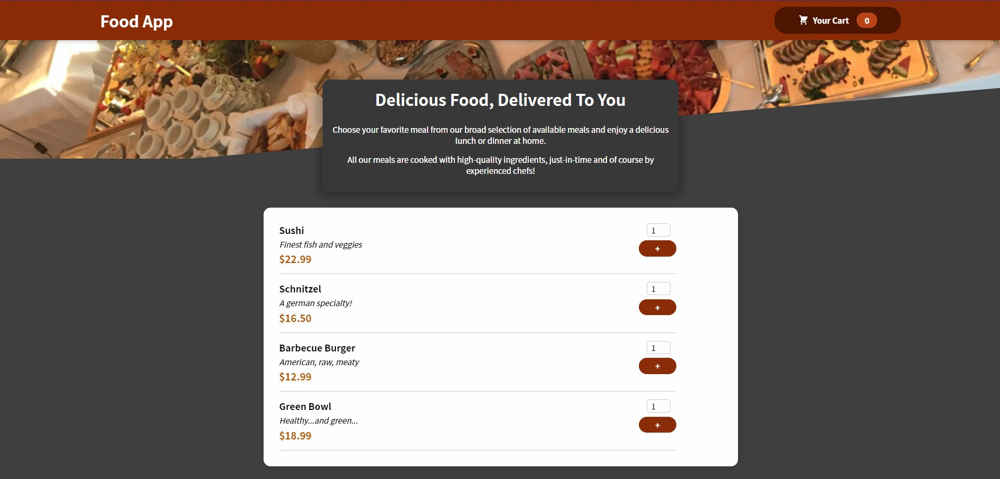
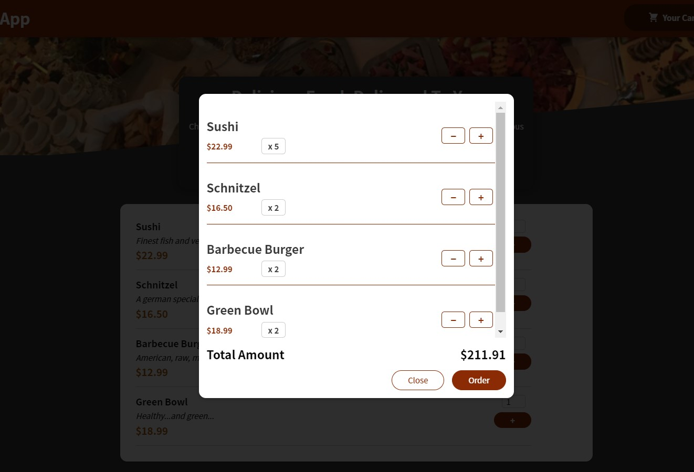

# food-order-app

This project created with React, you can [download](https://github.com/zarmintaa/food-order-app/archive/refs/heads/main.zip) it or copy this `git clone https://github.com/zarmintaa/food-order-app.git` and run on your terminal 

To run this app, run `npm install` and `npm run start` on terminal from your directory project

